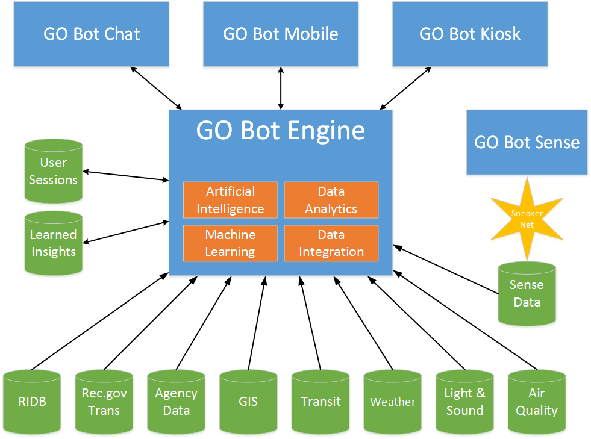

# The GO Bot Ecosystem

Team:  Booz Allen Hamilton, NIC, Trailhead Labs

This is the top lovel repository for the GO Bot BAYES Hackathon.  GO Bot consists of several different components, each with their own GitHUb repository.  Below are links to the code repositories for GO Bot:

* [GO Bot API/Engine Code Repository](https://github.com/bayeshack2016/go-bot-api)
* [GO Bot Chat Code Repository](https://github.com/bayeshack2016/go-bot-chat)
* [GO Bot Sense Code Repository](https://github.com/bayeshack2016/go-bot-sense)

Please see the README files for those repository for additional information on those components.

## What is GO Bot?

Experiencing the great outdoors can be very intimidating for those that are not accustomed to outdoor recreation in America’s public lands.  Major population segments remain underserved by our public recreation resources because they do not know where to start, what to do, and how to make the most from their outdoor experience.  Traditional digital recreation tools are tailored to those already experienced and comfortable with outdoor recreation.  The GO Bot ecosystem, on the other hand, is designed to provide all users with a powerful set of tools regardless of recreation experience level.  These tools are engaged through a conversational user interface via a variety of interaction channels.  Effectively, the GO Bot Ecosystem serves as an intelligent assistant capable of assisting the user throughout the entire recreation lifecycle.

The GO Bot user experience is founded on the following principles:

* The conversation is centered on the user’s current needs and intentions and will only ask the user for enough information to allow GO Bot to help the user fulfill their needs
* The conversation is conducted in simple, familiar language and avoids terms and syntax that an inexperienced user may find confusing
* GO Bot does not inundate the user with options but instead prompts the user for information that clarifies the user’s intentions and allows the AI to use the data to present a few high quality options
* The user is always provided the option of providing feedback so that GO Bot can learn how to better serve users in the future

##Conceptual Architecture

The figure below illustrates the conceptual architecture for the GO Bot Ecosystem.

At the heart of the GO Bot ecosystem is an intelligent engine that directs the conversation with the user to provide a personalized interaction tailored to the user’s specific intentions and preferences.  The engine interfaces with a wealth of recreation related data from both public and private sources to assist the user with making their recreation decisions.  These data sources are intelligently combined to recommend recreation options that best suit the individual seeking recreation assistance, simplifying the planning process and helping to ensure a satisfying recreation experience.

It is envisioned that the intelligent engine will be interacted with through three channels.  The first is through popular chat clients such as Facebook messenger.  A user simply engages the GO Bot as they would a human user by sending an introductory greeting or asking the GO Bot to help them do something.  The GO Bot then interactively asks the user questions, interprets the responses from the user, and presents useful information that will help the user make recreation decisions.  If needed, the GO Bot chat client will redirect the user to external resources such as Recreation.gov to complete follow up transactions.

The second way to interact with the GO Bot is through a native mobile application.  This native client functions in the same way as the chat clients, but provides extended ease of use by allowing the mobile user to talk to the GO Bot and hear audio responses in addition to the textual information returned during the conversation.  Most importantly, the mobile application allows a subset of the intelligence to be accessed while the device does not have Internet connectivity.  This allows the GO Bot to continue assisting the user during the recreation experience which likely will occur where there is limited or no connectivity.

The final channel of interaction is an interactive kiosk.  These kiosks will be deployed as a component of marketing campaigns and would target underserved user demographics in locations where people commonly pass or gather.  These kiosks would project large, live views of recreation attractions to grab the attention of those nearby.  Using Microsoft Kinect technology, the kiosk is able to detect the presence of individuals and allows them to interact with the kiosk using simple hand and body gestures to conduct a simple conversation with the GO Bot engine.

##Data Sources

Driving the intelligence of the GO Bot Ecosystem are a wide range of data sources.  These data sources can be classified into the following categories:  recreation resource data, environmental data, learned data, and real-time situational awareness.
Recreation resource data sources consist of the following:
* The Recreation Information Database (RIDB)
* Recreation.gov historical transaction data
* Agency-specific APIs and data sets
* Census data

Environmental data sources include:

* Transportation-related data for driving, public transportation, and walking/biking
* Current and forecasted weather conditions
* Ambient light and sound data
* Air quality data

Learned data includes:

* Historical information and feedback from individual user sessions
* Aggregated insights gained through analysis of user sessions

Real-time situational awareness is gained from sensors deployed throughout recreation areas.  Since these sensors do not exist today, the primary source of this data will be the GO Bot Sense hardware device.  The GO Bot Sense device is described in greater detail below.

##GO Bot Sense

The GO Bot Sense device is built on open source software and hardware technologies.  The device utilizes low cost hardware such as the Raspberry Pi.  This hardware is coupled with a variety of sensors that allow GO Bot Sense to collect real time information about a particular location within a recreation location.  Sensors would count visitors passing by the sensor using infrared motion sensors, read the temperature using a thermistor, record sound levels using a microphone, and record light levels using a photocell.  This information is stored on the device and is then uploaded to the central GO Bot system at a later time.  The intent is to build a low power device that can be powered by a battery and small solar panel.  The technologies needed to build GO Bot Sense exist today and should allow a hardened device to be deployed at under $100 per unit.

Data collection is only part of the GO Bot Sense’s job.  The GO Bot Sense can additionally provide the user timely information in locations where Internet connectivity does not exist.  This occurs through low-power Blue Tooth interactions between a mobile application running on the visitor’s phone and the GO Bot Sense hardware.  As the user nears a GO Bot Sense device, the mobile application and the GO Bot Sense exchange information bi-directionally.  Additionally, this exchange may trigger an interaction with GO Bot in a similar manner as a unidirectional iBeacon device.  Unlike an iBeacon, though, the data payload that is delivered is not simply an ID but contains actual data that can be presented to the user or considered in the conversation with GO Bot.

GO Bot Sense devices will frequently not have access to Wi-Fi or other wireless Internet connections.  This presents a challenge in collecting data from the device and updating data that should be delivered to visitors.  Some deployments may have a density of devices which allow a mesh network to be established using Wi-Fi protocols.  Often, though, the terrain and spacing of devices will prohibit a mesh network from working.  In these cases, the GO Bot Sense will use a novel “sneaker net” approach to data transmission.

The “sneaker net” leverages the data exchange between mobile applications and the GO Bot Sense hardware to shuttle data from node to node as a visitor or ranger walks between sensors.  For instance, as visitors hike through trails, the GO Bot Sense will send sensor data to the mobile application running on the visitors phone.  This information is then deposited on the next GO Bot Sense encountered on the trail.  Eventually, the information is propagated to a device on the edge of the network so that a ranger can easily collect the data and upload to the central GO Bot system.  Likewise, if a ranger wishes to update information delivered by the GO Bot Sense nodes, they would upload it to a device on the edge of the network and visitors would propagate the data to other nodes as they hiked the trail.

##Hackathon Progress

The vision for the GO Bot Ecosystem is no doubt ambitious.  During the BAYES Hack 2016 event, the combined Booz Allen Hamilton, NIC, and Trailhead Labs team attempted to prototype several aspects of the system to prove out the viability of the concept.  As is the case when trying to innovate in a very short timeframe, not all efforts resulted in a working prototype but much was learned from the experience.  Below is a summary of what was accomplished during the hackathon event.

* A functioning Facebook chat client was created which allows users to conduct a preliminary planning conversation with GO Bot.  The user is prompted to select an activity and GO Bot asks them a series of questions to ascertain there geographic and transportation preferences.  GO Bot then uses RIDB data, transportation data, and weather data to suggest options for recreation, ranked by popularity indicated by historical Recreation.gov sales data.
* The mobile application experience was prototyped in static form to demonstrate how GO Bot could be used during a recreation experience.  Unfortunately, time and resource constraints prevented this static prototype from being made into an actual dynamic mobile application.
* The GO Bot Sense hardware was assembled and progress was made on reading and storing of sensor data.  Due to limitations present in iOS related to Blue Tooth 4.0 protocol support, the sneaker net feature could not be implemented in the timeframe of the hackathon and resources were reassigned to assist with other components of the ecosystem.

Booz Allen Hamilton, NIC, and Trailhead Labs are confident that given more time that all components of the envisioned GO Bot ecosystem could be prototyped.  We look forward for the opportunity to invest additional time into proving out this innovative, user-centered approach that has the potential to significantly change how technology can assist those recreating in America’s public lands.
